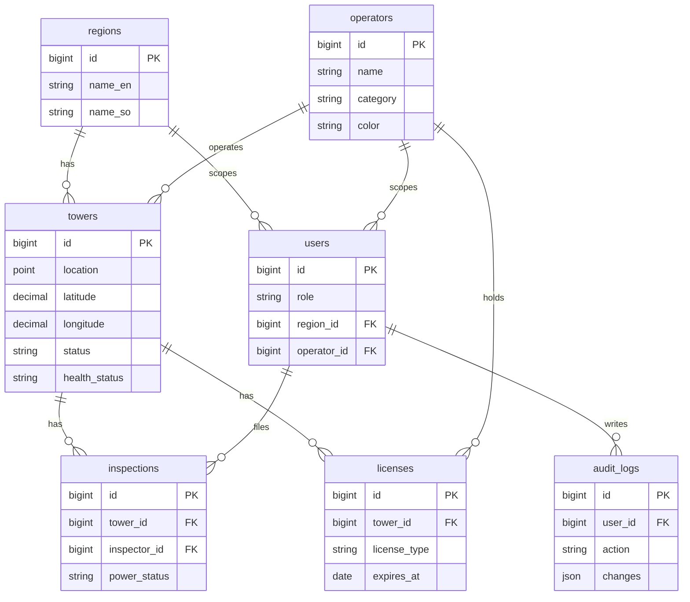

# TowerLine — Project Context

**Working name:** TowerLine  
**Official product name:** Wasaaradda Isgaarsiinta iyo Technology — Tower Management & Monitoring System  
**Client:** Ministry of Communication and Information Technology (MoCIT), Somaliland  
**Languages:** English (default) + Somali toggle  
**Status:** Building **one week at a time** (see §13).  
**Current week:** **Week 11 complete — Users & audit log UI**  
**Last completed:** **Week 10 — Licenses**  
**Source of truth:** this file. Update it when a product decision changes.

---

## 1. What we are building

A government registry, map, monitoring, and compliance system for telecom **and broadcast (TV/cable)** towers across Somaliland.

Ministry staff need one place to:

- See every tower on a map, filtered by region, operator, status, and license state
- Keep a structured registry (location, operator, type, height, capacity, status)
- Record field inspections (power, generator/battery, physical condition, photos, notes)
- Track licenses (types A, B, C) and renewal dates on the dashboard
- Restrict access by role (ministry admin, regional inspector, operator viewer)

The **map dashboard is the flagship**. It must work for daily internal use, live briefings, and a printable/exportable snapshot.

This is **not** a consumer product. Official, bilingual, usable on tablet/phone in the field with poor connectivity.

---

## 2. Source documents

| File | Role |
|---|---|
| `tower-management-system-plan.md` | Original 12-week delivery plan |
| `Tower Mangement Design refrence.md` | Build spec (stack, branding, schema, screens) |
| `wasaarada logo.jpg` | Official Somaliland emblem — use in header / login |
| `CONTEXT.md` (this file) | Locked decisions + implementation guide |

Build from the design reference + this file. No separate Figma phase — the app **is** the design.

---

## 3. Locked decisions (answered 19 Aug 2026)

| Topic | Decision |
|---|---|
| Tower inventory | Real list comes later. Demo uses sample data only. |
| Operators | **Telecom:** Telesom, Somtel, Sogasho. **Broadcast:** Truecable, Astaan, Horncable |
| Regions | Awdal, Maroodi Jeex, Sahil, Togdheer, Sanaag, Sool |
| Inspectors | Ministry members (MoCIT staff), scoped to a region |
| Hosting | Not decided; likely **government server**. Keep standard Laravel (Apache/Nginx + PHP + MySQL). No Redis required. |
| Map success | Daily use **and** live briefings **and** snapshot/print |
| Default language | **English** (`en`). Somali available via toggle. |
| Logo | `wasaarada logo.jpg` (Somaliland emblem) |
| Design | Implement the design-reference prompt directly — no Figma wait |
| Scale | Production will be **hundreds** of towers. Demo seed: **3–5 towers per region** |
| License types | **A, B, C** only |
| Renewal reminders | **Dashboard only** (no email/SMS in v1) |
| Inspector home | Map (flagship for field staff) |
| Operator home | Map (their towers only) |
| Admin home | Dashboard |
| Offline | Graceful POST forms, not a service-worker offline app |
| Coverage circles | Colored by **operator** |
| Auth registration | Disabled. Admins create users. |

---

## 4. Goals (demo / v1)

1. Full-screen Leaflet map: color-coded, filterable, clustered, coverage circles, print/snapshot
2. Tower registry CRUD with search/filter/pagination
3. Inspection forms as standard HTML POST
4. License list + 30-day expiry **banner on dashboard**
5. Three roles with Laravel policies
6. Bilingual UI via `lang/en` and `lang/so`
7. Audit log
8. Sample seed: 6 regions, 6 operators, 3–5 towers each, mixed health/licenses

### Out of v1

- Live SNMP / operator API feeds
- SMS / email reminders
- Public-facing coverage map
- Native mobile app
- React/Vue SPA
- Import of the real tower spreadsheet (later)

---

## 5. Users and roles

Inspectors are **ministry employees**, not contractors.

| Role | Key | Access |
|---|---|---|
| Ministry admin | `admin` | Everything |
| Regional inspector | `inspector` | View/edit towers and submit inspections **only in their `region_id`**. Map scoped. No user admin. |
| Operator viewer | `operator_viewer` | Read-only, scoped to their `operator_id` (including inspections and licenses) |

---

## 6. Tech stack (locked)

| Layer | Choice |
|---|---|
| Backend | Laravel (latest stable) |
| Frontend | Blade + Tailwind CSS + Alpine.js |
| Auth | Laravel Breeze (Blade) |
| DB | MySQL 8+ (XAMPP locally). `latitude`/`longitude` decimals + `POINT` `location` with spatial index |
| Map | Leaflet.js + OpenStreetMap |
| Clustering | Leaflet.markercluster |
| Coverage | Custom Leaflet circles from `signal_radius_m` |
| Photos | `storage/app/public` |
| Audit | Custom `audit_logs` table |

**Do not introduce:** React/Vue, Google Maps, paid map tiles, GraphQL, Redis as a hard requirement.

Local demo DB: `towerline` on XAMPP MySQL (`127.0.0.1`, user `root`, empty password unless `.env` says otherwise).

---

## 7. Design system

### Brand

- **Primary:** deep forest / emerald `#1B4D3E` — nav, headers, primary buttons
- **Accent:** mint/sage `#A8C5B5`
- **Surface:** `#F7F8F6`
- **Text:** `#1A1A1A` / secondary `#4B5563`
- **Emblem gold (logo bg, sparingly):** `#F5C518` — do not flood the UI with yellow
- **Header:** emblem + ministry name in both languages + language toggle  
  - SO: `Wasaaradda Isgaarsiinta iyo Technology`  
  - EN: `Ministry of Communication and Technology`

Tone: official government. No startup gradients, no decorative animation.

Logo file lives at `public/images/mocit-logo.jpg` (copy of `wasaarada logo.jpg`).

### Status colors (never use brand green for status)

| Meaning | Hex |
|---|---|
| Healthy | `#22C55E` |
| Needs attention | `#F59E0B` |
| Critical / expired | `#DC2626` |
| Inactive / decommissioned | `#6B7280` |
| Under construction | `#2563EB` |

### Operator colors (coverage circles + legend)

| Operator | Color |
|---|---|
| Telesom | `#0F766E` |
| Somtel | `#1D4ED8` |
| Sogasho | `#7C3AED` |
| Truecable | `#C2410C` |
| Astaan | `#BE185D` |
| Horncable | `#B45309` |

### Layout

- App shell: top bar (emblem, bilingual title, language, user) + left nav desktop; drawer on mobile
- Map: full viewport minus chrome; left filter panel (collapsible); **Print / snapshot** button for briefings
- Tables: Laravel pagination, sortable, filters
- Forms: `__()` / `@lang`, POST/redirect/GET
- Default locale `en`, session toggle to `so`

---

## 8. Geography and operators (seed)

| `name_en` | `name_so` | Anchor (approx.) |
|---|---|---|
| Awdal | Awdal | Borama 9.936, 43.182 |
| Maroodi Jeex | Maroodi Jeex | Hargeisa 9.562, 44.077 |
| Sahil | Saaxil | Berbera 10.434, 45.014 |
| Togdheer | Togdheer | Burao 9.522, 45.534 |
| Sanaag | Sanaag | Erigavo 10.616, 47.368 |
| Sool | Sool | Las Anod 8.477, 47.360 |

Map default: center ~ `9.56, 44.06`, zoom 7, Somaliland bounds.

| Operator | `category` |
|---|---|
| Telesom | telecom |
| Somtel | telecom |
| Sogasho | telecom |
| Truecable | broadcast |
| Astaan | broadcast |
| Horncable | broadcast |

**Broadcast coverage (sample data):** Truecable, Astaan, and Horncable operate in **Hargeisa** only so far, and are **starting work in Borama**. No TV/cable sample towers in other towns.

Seed **4 towers per region** (24 total), mixed operators, mixed status/health/licenses so the map and dashboard look real.

---

## 9. Data model

```
regions 1──* towers *──1 operators
users.region_id  → regions     (inspectors)
users.operator_id → operators  (operator viewers)
towers 1──* inspections
towers 1──* licenses
users  1──* inspections (inspector_id)
users  1──* audit_logs
```

### `regions` — id, name_en, name_so, timestamps

### `operators` — id, name, category (`telecom`/`broadcast`), logo nullable, contact_info nullable, color (hex), timestamps

### `towers`

- name, latitude `decimal(10,7)`, longitude `decimal(10,7)`, location `POINT` SRID 4326 + spatial index
- region_id, operator_id
- type: `guyed` / `monopole` / `rooftop`
- height_m, capacity (string), signal_radius_m
- status: `active` / `under_construction` / `decommissioned`
- health_status cached: `good` / `needs_attention` / `critical` / `unknown` (recalc on inspection save)
- commissioned_at nullable
- no soft deletes

Keep lat/lng and `location` in sync on `saving`.

### `inspections`

- tower_id, inspector_id
- power_status: `on_grid` / `generator` / `battery` / `down`
- generator_condition: `good` / `fair` / `poor` / `n_a`
- physical_condition: `good` / `fair` / `poor`
- notes, photos (json paths)
- inspected_at (default now)

Health rules:

- Critical: power `down` OR physical `poor`
- Needs attention: generator `poor` OR physical `fair`
- Good: otherwise
- Unknown: no inspections

Overdue: no inspection in **90 days**.

### `licenses`

- tower_id, operator_id
- license_type: `A` / `B` / `C`
- issued_at, expires_at
- documents: JSON list of scanned files (PDF / photo / Word), stored on the public disk
- Display status **computed from dates** (not stored): expired / expiring_soon (≤30 days) / active

### `users` — Breeze + role (`admin`/`inspector`/`operator_viewer`) + region_id + operator_id

### `audit_logs` — user_id, action, model_type, model_id, changes json, created_at

---

## 10. Screens

1. **Auth** — branded login, no register. Forgot password hidden unless mail is configured.
2. **Dashboard** — cards (total towers, alerts, needing inspection, licenses ≤30 days) + mini map + expiry banner
3. **Map (priority)** — filters (region, operator, category, status, license, health), clusters, coverage toggle, side panel on pin click, print/snapshot, role-scoped JSON
4. **Registry** — paginated table, CRUD, map-click lat/lng picker, detail with history + mini map
5. **Inspections** — mobile-first POST form + photo upload + history
6. **Licenses** — list sortable by expiry, A/B/C badges, dashboard banner only
7. **Admin** — users, operators, regions, audit log

---

## 11. Routes (authenticated)

- `GET /` dashboard
- `GET /map` + `GET /map/towers` JSON
- `resource towers` + nested inspections store
- `resource licenses`
- `resource users` (admin)
- `resource operators` / `resource regions` (admin)
- `GET /audit-logs` (admin)
- `POST /locale`

Policies on every write. Map JSON never includes out-of-scope towers.

---

## 12. Demo accounts (local only)

Password for all: `password`

| Email | Role | Scope |
|---|---|---|
| admin@mocit.local | admin | all |
| inspector.maroodi@mocit.local | inspector | Maroodi Jeex |
| inspector.sahil@mocit.local | inspector | Sahil |
| viewer.telesom@mocit.local | operator_viewer | Telesom |
| viewer.truecable@mocit.local | operator_viewer | Truecable |

---

## 13. How we work (weekly)

Do **not** build the whole product in one pass. Each session finishes **one week’s deliverable**, then we stop until you say to start the next week.

| Week | Focus | Status |
|---|---|---|
| 1 | Discovery & requirements | **Done** — answers locked in this file |
| 2 | Design | **Done as context** — no Figma; design reference + this file |
| 3 | Data model & architecture | **Done** |
| 4 | Tower registry backend + sample seed + registry screens | **Done** |
| 5 | Tower registry UI (list, form, detail, search/filter, bilingual, locale toggle) | **Done** |
| 6 | Map v1 | **Done** |
| 7 | Map polish (clustering, layer toggles, mobile) | **Done** |
| 8 | Inspections | **Done** |
| 9 | Health rollup & alerts | **Done** |
| 10 | Licenses (A/B/C), dashboard banner, documents | **Done** |
| 11 | Roles polish & audit log UI | **Done** |
| 12 | Test, pilot, handover | Later |

Auth (Breeze) is installed. User-admin and audit-log screens are live for ministry admins.

- User-facing strings go through lang files (`en` default)
- Writes ministry staff care about → `audit_logs`
- Map JSON is role-scoped
- Boring Laravel: controllers, Blade, Form Requests, Policies, seeders
- When the real tower list arrives, add an importer; do not hand-edit production coordinates in seeders

---

## 14. Week 3 deliverable — ER + route spec



**Routes we will add in later weeks (spec only this week):**

| Method | Path | Week |
|---|---|---|
| GET/POST | `/login` `/logout` | 3 (Breeze) |
| GET | `/dashboard` | 3 stub → 9 cards |
| GET | `/map` `/map/towers` | 6–7 (done) |
| resource | `/towers` | 4–5 |
| POST | `/towers/{tower}/inspections` | 8 (done) |
| resource | `/licenses` | 10 (done) |
| resource | `/users` | 11 (done) |
| GET | `/audit-logs` | 11 (done) |
| POST | `/locale` | 5 (done) |

## 15. Still open (not blocking demo)

- Exact government-server PHP/MySQL versions
- Production domain / intranet vs public
- Official Somali spellings if MoCIT differs
- Real inventory import format (spreadsheet columns)
- SMTP later if they want email reminders in a later phase
